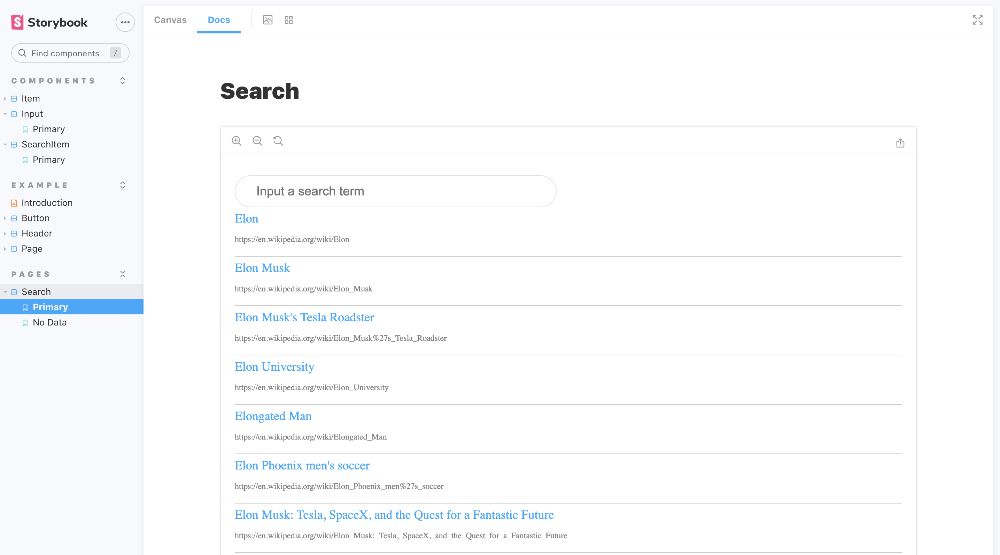

# Google Wikipedia Api search with Storybook and JEST


## Installation

```bash
# install dependencies
npm install

# run Storybook
npm run storybook

# build Storybook
npm run build-storybook

# run project
npm start

#run test coverage report
npm run test:ci
```

StoryBook runs on `localhost:6006`



