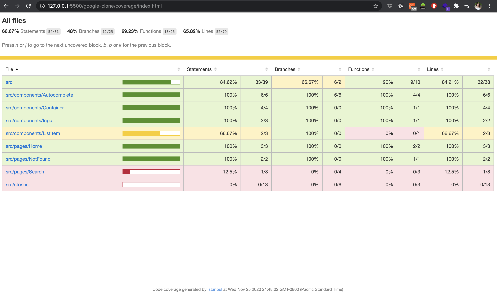
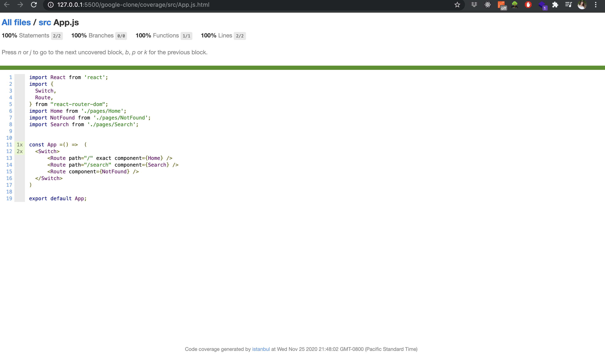
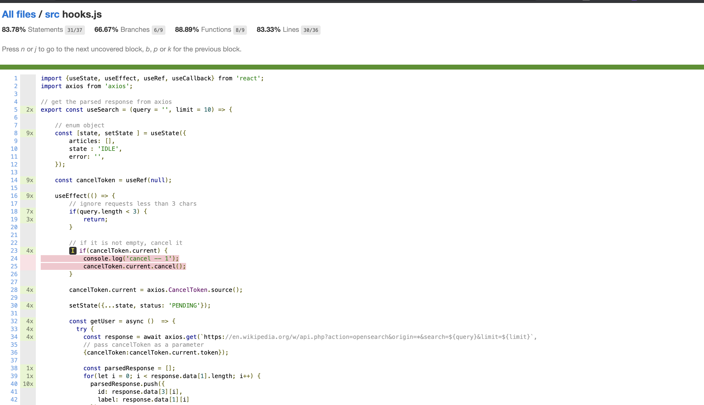

# Google Wikipedia Api search with Storybook and JEST


## Installation

```bash
# install dependencies
npm install

# run Storybook
npm run storybook

# build Storybook
npm run build-storybook

# run project
npm start

#run test coverage report
npm run test:ci

```

StoryBook runs on `localhost:6006`


## Code Coverage Report 

After you run `npm run test:ci`, it will create a `coverage` folder. From there, navigate into `src/index.html` see the report. When you update the tests, delete the coverage report and run `npm run test:ci` again, it will update the report.





